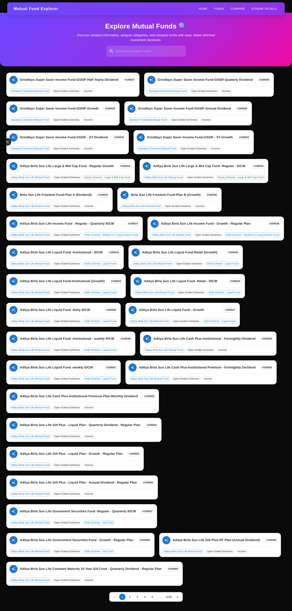
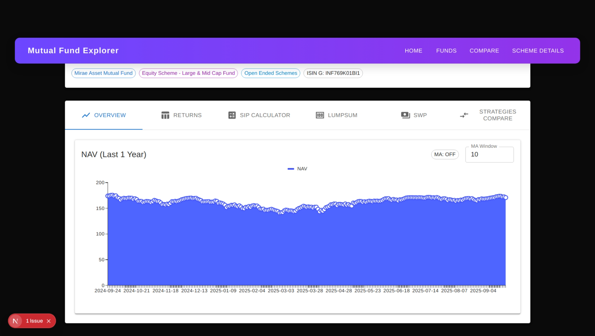

# 📊 Mutual Fund Explorer

**Mutual Fund Explorer** is a modern **Next.js** application designed to help users explore Indian mutual funds efficiently. You can search for schemes, view detailed metadata, analyze NAV trends and returns, and run SIP, Lumpsum, or SWP simulations. The project also includes a **theme system** with color and mode switching, as well as a **Fund Comparison Tool**.

---

## 🛠 Technology Stack

- **Framework:** Next.js 15 (App Router) with Turbopack  
- **UI Library:** MUI v7 (with Emotion)  
- **Charts & Visualization:** `@mui/x-charts`  
- **Backend:** Next.js API routes (`src/app/api`)  

---


## Setup & Running

1) Install dependencies
```bash
npm install
```

2) Run dev server
```bash
npm run dev
```

3) Open `http://localhost:3000`

Environment: no special env vars required for local.

---
## Key Features

### 🧭 Navigation
- Seamless multi-page navigation: **Home**, **Funds**, **Scheme Details**, and **Fund Comparison Tool**  
- Intuitive layout ensuring quick access to all core functionalities  

### 💹 Funds Listing
- Smart search with **autocomplete filtering** for quick scheme discovery  
- Professional, responsive cards featuring avatars, scheme titles, and metadata chips  
- Adaptive grid layout: displays 1–3 cards per row depending on screen size  
- Smooth hover animations for better interactivity and quick navigation to individual scheme pages  

### 📊 Scheme Details
- **Overview Tab:** Interactive NAV chart for the past year, with area fill and optional **moving average** overlays  
- **Returns Tab:** Pre-calculated returns for informed investment analysis  
- **SIP Calculator:** Simulate systematic investment plans with flexible inputs  
- **Lumpsum Calculator:** Evaluate one-time investments across schemes  
- **SWP (Systematic Withdrawal Plan):** Plan withdrawals efficiently  
- **Strategies Compare Tab:** Visual comparison of SIP vs Lumpsum vs SWP strategies  
- **Dynamic Loader:** Branded loading animation ensures a smooth user experience while data is fetched  

### 📈 Fund Comparison Tool (`/compare`)
- Compare multiple schemes side-by-side with ease  
- Overlay **NAV trends** for selected schemes over the last year  
- Comprehensive **metadata snapshot**: fund house, type, and category  
- **Risk vs Return Scatter Plot:** Assess volatility versus average return for informed decisions  


## Screenshots

Place the images below in `public/screenshots/`. If your filenames differ, either rename them or update the paths here.




### ScreenShot




### ScreenShot


---

## Project Structure
```
src/
  app/
    page.js                # Home
    funds/page.js          # Funds list
    scheme/[code]/page.js  # Scheme detail tabs
    compare/page.js        # Fund comparison tool
    api/...                # Data endpoints
  components/
    NavBar.js
    ThemeProviderClient.js
    BrandedLoader.js
```

---


This version:  
- Uses professional language and consistent terminology.  
- Highlights features clearly with icons and bold headings.  
- Improves readability with bullet points, spacing, and clear sections.  
- Provides polished instructions for setup, screenshots, and deployment.  

If you want, I can also **add a visual “Feature Table” with icons** to make the README look like a professional SaaS product page, which is very appealing on GitHub.  

Do you want me to do that next?
