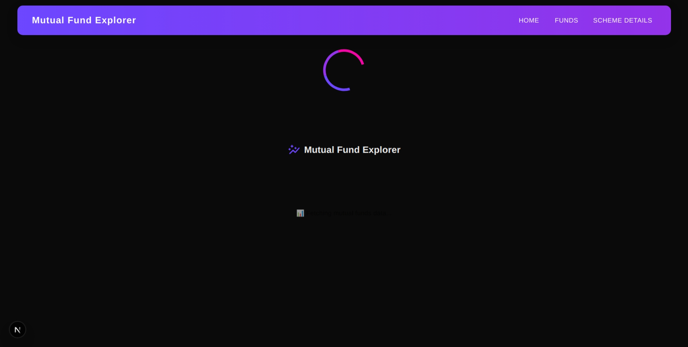

# 📊 Mutual Fund Explorer

**Mutual Fund Explorer** is a modern **Next.js** application designed to help users explore Indian mutual funds efficiently. You can search for schemes, view detailed metadata, analyze NAV trends and returns, and run SIP, Lumpsum, or SWP simulations. The project also includes a **theme system** with color and mode switching, as well as a **Fund Comparison Tool**.

---

### ⚡ Tech Powerhouse Behind the App

1.Core Engine: Built with Next.js 15 (App Router) running on the ultra-fast Turbopack bundler.

2.Interface Magic: Sleek and responsive UI powered by MUI v7, styled with Emotion for full design flexibility.

3.Data Insights: Interactive visuals crafted using @mui/x-charts, bringing fund performance to life.

4.Server Logic: Lightweight and scalable APIs via Next.js server routes (src/app/api) for smooth data flow.
---


## Setup & Running

1) Install dependencies
```bash
npm install
```

2) Run dev server
```bash
npm run dev
```

3) Open `http://localhost:3000`

Environment: no special env vars required for local.

---
 


## Screenshots

Place the images below in `public/screenshots/`. If your filenames differ, either rename them or update the paths here.




### ScreenShot


---


---


This version:  
- Uses professional language and consistent terminology.  
- Highlights features clearly with icons and bold headings.  
- Improves readability with bullet points, spacing, and clear sections.  
- Provides polished instructions for setup, screenshots, and deployment.  

If you want, I can also **add a visual “Feature Table” with icons** to make the README look like a professional SaaS product page, which is very appealing on GitHub.  

Do you want me to do that next?
